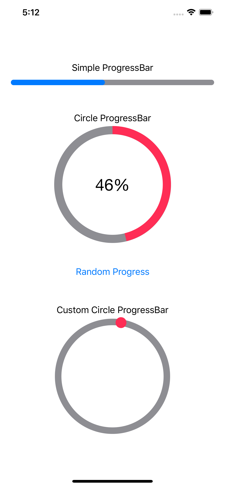

# ProgressBar-with-SwiftUI
How to implement the ProgressBar with SwiftUI 




## Simple Usage

### Simple Progressbar

```swift
ProgressBar(progress: self.$progress,
                        width: UIScreen.main.bounds.size.width - 40,
                        height: 10,
                        progressColor: .blue,
                        staticColor: .gray)
```

### Circle ProgressBar

```swift
CircleProgressBar(circleProgress: self.$progress,
                              widthAndHeight: 200,
                              labelSize: 30,
                              progressColor: .pink,
                              staticColor: .gray)
```

### CircularActivityIndicator

```swift
CircularActivityIndicatory(widthAndHeight: CGFloat(200.0),
                                       indicatorColor: .pink,
                                       staticColor: .gray,
                                       lineWidth: CGFloat(12.0))
```
